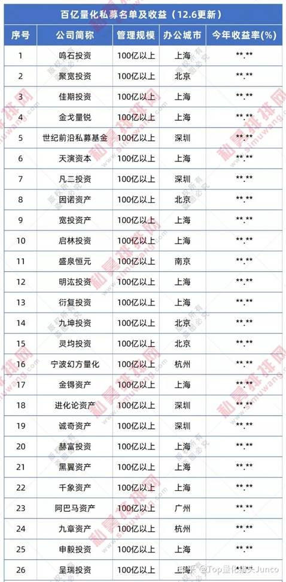
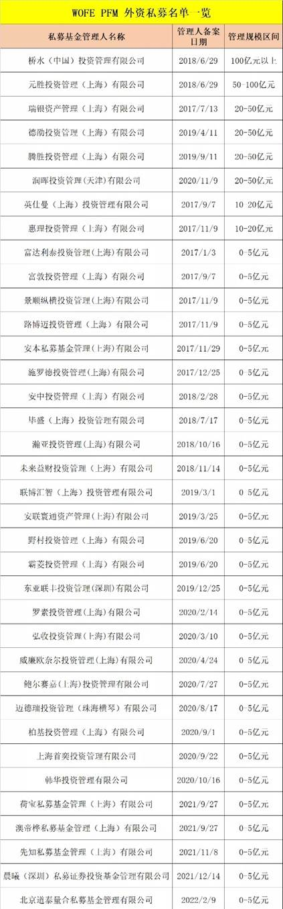

# 量化投资

#### 规模较大的量化私募公司

+ 本地：
  

+ 外资量化机构：
  

### 基础知识

##### 量化投资定义：

通过计算机来执行提前设置好的投资策略，由计算机做出买卖指令的投资方式（不同于常说的PE/VC）

##### 分类：

目前主流的量化策略：

+ Alpha策略：
  Alpha策略是典型的市场中性策略，通过统计、机器学习等手段，来选择具有超额收益的个股来构建组合，同时通过风险管理工具（股指期货、股指期权或指数ETF）来对冲掉系统性风险，最终赚取超额收益。

  *该策略可以有效地抵消掉市场风险，策略收益完全取决于投资者的选股能力*

+ Smart Beta策略：
  市场的有效性逐渐变强，想要找到稳定的Alpha变的更加困难，因此一部分投资者开始尝试Smart Beta这一类策略，其采用的方式是在Beta部分做相应的调整，在特定的因子上做特别的暴露（例如增加某一行业的暴露），从而取得超过指数的超额收益。

+ 套利策略：
  无风险套利策略；统计套利（基于均值回归的理念，基于历史统计）

+ CTA策略（管理期货策略）：
  利用了期货T+0以及可以做空的机制，对期货合约在当日进行买入和卖出，其通常通过对历史进行统计，或者训练机器学习的模型来决定买卖点，在日内进行频繁的买入卖出来赚取收益。CTA策略中，往不会将堡压在一个标的上，通过量化的方式，可以实现同时对多只标的进行操作，从而有效地控制风险。同时，由于该类策略是会在当日进行平仓的，且可以双向操作，所以此类策略不怕市场风格的变化，在各类行情中都有机会赚取收益。

+ PS：多种策略的融合策略

#### 所需技能：

1. 编程：主流编程语言python（numpy,pandas,scipy,sklearn,pytorch)，C++用于高频策略以获得更高性能的程序，SQL轻量级可用于快速验证初步策略；数据结构和算法，操作系统（可旁听），机器学习。
2. 金融基础：熟悉重要理论，eg：CAPM、APT，计量经济学内容有助于量化策略的设计与开发；经济学原理，金融市场，公司金融，风险管理，证券投资，金融衍生工具和衍生品定价。
3. 数学：应用于风险控制、因子挖掘一级期权定价；微积分，线性代数，概率论与数理统计，常微分方程，偏微分方程，随机过程，时间序列，非线性规划（可旁听），最优化方法（可旁听）
4. 英语：掌握前沿研究成果，开拓新量化方法。

#### 开源项目：

[关于高频量化交易的代码项目 - 知乎 (zhihu.com)](https://zhuanlan.zhihu.com/p/558902211)
